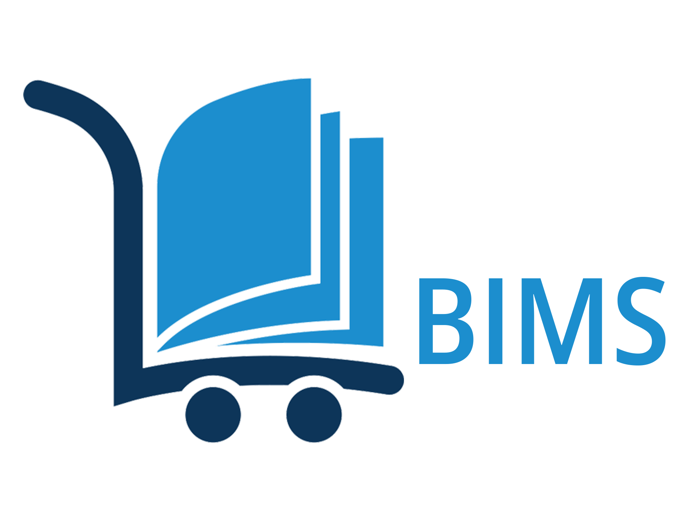

# BIMS

<div align="center">
  <a href="https://bims.runasp.net/">
    
  </a>
</div>

BIMS stands for [Book Inventory Management System] 
[Demo URL](https://bims.runasp.net/)


<details>
  <summary>Table of Contents</summary>
  <ol>
    <li>
      <a href="#Project-Description">Project Description</a>
      <ul>
         <li><a href="#Book-Module">Book</a>
         <li><a href="#Book-Copy">Book Copy</a>
         <li><a href="#Author-Module">Author Module</a>
         <li><a href="#Category-Module">Category Module</a>
         <li><a href="#Subscribers-Module ">Subscribers Modules</a>
         <li><a href="#Rental-Module">Rental Modules</a>
         <li><a href="#Search-Module">Search Modules</a>
         <li><a href="#Users-Module">Users Module</a>
      </ul>
    </li>
        <li>
      <a href="#Business-Validations">Business Validations</a>
      <ul>
         <li><a href="#Author">Author</a>
         <li><a href="#Category">Category</a>
         <li><a href="#Subscriber">Subscriber</a>
         <li><a href="#Book">Book</a>
         <li><a href="#Rental">Rental</a>
         <li><a href="#Return">Return</a>
         <li><a href="#Extend">Extend</a>
      </ul>
    </li>
    <li>
      <a href="#Users-and-Roles">Users and Roles</a>
      <ul>
        <li><a href="#Roles">Roles</a></li>
        <li><a href="#Users">Users</a></li>
      </ul>
    </li>
    <li><a href="#Used-Technology">Used Technology</a>
    <ul>
        <li><a href="#frameworks-and-libraries">Frameworks and libraries</a></li>
        <li><a href="#Third-Party-Libraries">Third-Party Libraries</a></li>
    </ul>
    </li>
        <li><a href="#Technical Points">Technical Points</a>
    <ul>
        <li><a href="#Design">Design</a></li>
        <li><a href="#Security">Security</a></li>
        <li><a href="#Validation">Validation</a></li>
        <li><a href="#error-hanlding-and-logging">Error Hanlding and logging</a></li>
        <li><a href="#Entity-Framework-Core">Entity Framework Core</a></li>
        <li><a href="#ASP.NET-Core-dentity">ASP.NET Core Identity</a></li>
    </ul>
    </li>
    <li><a href="#Installation">Installation</a>
    <li><a href="#Future-Enhancement">Future Enhancement</a>
  </ol>
</details>

## Project Description

BIMS is a specialized software application designed to manage and organize the inventory of books for bookstores or libraries. This system simplifies the task of tracking book quantities, locations, and statuses within a storage or retail environment.


#### Book module
serves as the central database for managing detailed information about books, including title, author, publisher, category, publication year, image, description, and physical location. 
Complementing this, the Book Copy module is specifically designed to handle different editions of books, each with a unique serial number, facilitating precise tracking and management of individual book copies.

#### Author Module 
is an essential component to manage and organize information about the authors of books within the inventory.

#### Category Module 
is a critical feature to facilitate the organization and classification of books into various categories or genres.

#### Subscribers Module 
This module is designed to manage and maintain records of all individuals who subscribe to or are members of the service. It handles everything from registration data, including name, national ID, mobile number, email, image, and address, to subscription renewals and rental data. 

#### Rental Module 
This module is a vital component , designed to manage and streamline the entire process of book rentals. It covers everything from book check-out, validating subscribers and their copies, to the return of the books.

#### Search Module 
is a fundamental component of a Book Inventory Management System, designed to facilitate efficient and accurate search capabilities across all books within the system.

#### Users Module
The system supports multiple users, featuring three main roles, each with distinct permissions.

User Interface: The system features a user-friendly interface that allows easy navigation and operation for users of all technological competencies.

## Business Validations

#### Author  
* Name is Unique and MaxLength is 200 

#### Category  
* Name is Unique and MaxLength is 100 

#### Subscriber
* NationalId is Unique and MaxLength is 20 
* MobileNumber is Unique and MaxLength is 15 
* Email is Unique and MaxLength is 150 
* ImageUrl MaxLength is 500 
* Image is mendatory 
* Address and MaxLength is 500 
* FirstName MaxLength is 100 and Deny Special Characters
* LastName MaxLength is 100 and Deny Special Characters
* DateOfBirth should be <= Today 

#### Book
* Book title with author is unique and MaxLength is 100 
* Publisher MaxLength is 200 
* Publishing Date should be <= Today 
* Hall MaxLength is 50 
* Description is mendatory

#### Rental
- When adding rentals, validation should occur in two scopes:
	- Book Copy 
		- Available for rental
		- Valid Serial Number
		- Book not used in other rental
		- Subscriber not has same book (different Serial) in another rental
	- Subscriber 
		- not black list
		- Has Active subscription (subscription end date > today + RentalDuration (7))
		- not exceed max allowed copies (3)

- Edit/Cancel Rental
  -  Rentals may be edited or canceled on the day they are created.

#### Return
- Users can return rental starting the day after the rental start date, not on the same day the rental begins.

#### Extend
- When adding extensions, validation should occur in two scopes:
  - Rental
    - Can only be made once and must commence the day after the rental start date, not on the initial start date.
    - Can be extended within the original rental duration of 7 days, starting from the original end date.
  - Subscriber 
    - not black list
    - has active subscription (subscription end date >= extend end date).


## Users and Roles

### Roles 

| Role             | Permission    |
| ----------------- |--------------------------------------------- 
| Admin | Add/Edit User - Manage User Roles - Unlock Users - Toggle User Status - Reset Password|
| Archive | Add/Edit Author - Toggle Author Status - Add/Edit Category - Toggle Category Status - Add/Edit Book - Toggle Book Status - Add/Edit Book Copy - Toggle Book copy Status - Show Book Rental History |
| Reception | Add/Edit Subscriber - Renew Subscription - Add/Cancel/Edit Rental - Return Rental - Extend Rental |

- All roles have permission to access the Search module.

### Users 

| User             | Role                                                                |
| ----------------- | ------------------------------------------------------------------ |
| Super Admin | All Roles |
| Admin | Admin Role |
| Archive | Archive Role only |
| Reception | Reception Role only |

#### Notes

- Newly created users will receive an email to confirm their account before they can log into the system.
- Users can reset their password using the 'forget password' feature after receiving a confirmation email at their registered email address.

## Used Technology

#### Frameworks and libraries


* [![NET][Net.com]][NET-url]
* [![Efcore][Efcore.com]][Efcore-url]
* [![SQL Server][MSSQL.com]][MSSQL-url]
* [![Bootstrap][Bootstrap.com]][Bootstrap-url]
* [![JQuery][JQuery.com]][JQuery-url]

#### Third-Party Libraries


| Name             |                                                                 |
| ----------------- |----------|
| Mertonics |[Link](https://preview.keenthemes.com/metronic8/demo14/index.html) |
| animate.css| [Link](https://animate.style/) | 
| DataTables |[Link](https://datatables.net/) |
| ImageSharp.Web |[Link](https://sixlabors.com/products/imagesharp-web/) |
| Fslightbox |[Link](https://fslightbox.com/) |
| Typeahead.js |[Link](https://twitter.github.io/typeahead.js/) |
| ASP.NET Core Data Protection |[Link](https://learn.microsoft.com/en-us/aspnet/core/security/data-protection/configuration/overview?view=aspnetcore-8.0) |
| Serilog |[Link](https://serilog.net/) |
| AutoMapper |[Link](https://automapper.org/) |
| UoN.ExpressiveAnnotations|[Link](https://www.nuget.org/packages/UoN.ExpressiveAnnotations.NetCore) |
| tinymce|[Link](https://github.com/tinymce/tinymce) |
| Google Email Service |[Link](https://support.google.com/mail/answer/185833?hl=en)|

## Technical Points 

#### Design
- Project design adheres to Clean Architecture principles, separating concerns to promote modularity, scalability, and maintainability.

#### Security 
- Used `Data Protection` to protect query strings in urls like Ids
- Force Disallow IFrame
- Use `No Script` Tag
- Gobal Apply AntiforgeryTokenAttribute
- Add a custom filter, `AjaxOnlyAttribute`, to ensure that specific actions can only be accessed via Ajax requests.

#### Validation 
- Implement regular expressions to validate data formats for mobile numbers, national IDs, and usernames.
- Used `AssertThat` and `RequiredIf` attributes from the UoN.ExpressiveAnnotations package to enforce conditional validation rules in the application.

#### Error Hanlding and logging 
- Handle errors throughout the application and log them in both the database and a file.
- Enhance the Error View to display the status code and ensure errors are logged in both the database and a file.

#### Entity Framework Core
- Implement a sequence to automatically assign serial numbers to book copies.
- Use Fluent API instead of Data Annotations for configuring entity models in the application.
- All entities support soft deletion.
- Set Delete Behavior to be Restrict.
- Apply Global Query Filter to execlude deleted rows

#### ASP.NET Core Identity 
- Add custom claim to include the user's full name.
- set Password `RequiredLength = 8`
- Set Lockout `MaxFailedAccessAttempts = 5` and `DefaultLockoutTimeSpan = 5 Minutes`
- Set Cookie `ExpireTimeSpan = 1 Day`
- Require Confirmed Account 
- Implement a mail service to confirm new accounts and manage password resets and changes through emails sent to the user's registered email address.

## Installation

1. Clone the repo
   ```sh
   git clone https://github.com/1Mostafasalem/BIMS.git
   ```
2. Update the `appsettings.json` file to include the database connection strings under DefaultConnection and configure Serilog for logging

3. Build Project 

4. Run

#### Notes

- All migrations will execute automatically.
- Test users, including Super Admin, Admin, Archive, and Reception, will be created.
- The tables for Area, Government, and Categories will be seeded with data.

## Future Enhancement

* Integrate background tasks using Hangfire to send reminders to subscribers about rental and subscription expiration.
* Implement localization to support multiple languages.

[Bootstrap.com]: https://img.shields.io/badge/Bootstrap-563D7C?style=for-the-badge&logo=bootstrap&logoColor=white
[Bootstrap-url]: https://getbootstrap.com
[JQuery.com]: https://img.shields.io/badge/jQuery-0769AD?style=for-the-badge&logo=jquery&logoColor=white
[JQuery-url]: https://jquery.com 
[Net.com]:https://img.shields.io/badge/-.NET%208.0-blueviolet
[Net-url]:https://dotnet.microsoft.com/en-us/download/dotnet/8.0
[MSSQL.com]:https://img.shields.io/badge/Microsoft%20SQL%20Server-CC2927?logo=microsoftsqlserver&logoColor=fff&style=for-the-badge
[MSSQL-url]:https://www.microsoft.com/en-us/sql-server/sql-server-downloads
[efcore.com]:https://img.shields.io/badge/Microsoft%20Entity%20Framework%20Core-CC2927?logo=efcore&logoColor=fff&style=for-the-badge
[efcore-url]:https://www.microsoft.com/en-us/sql-server/sql-server-downloads